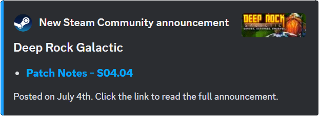

# Steam Community Watcher

Get notified of [Steam Community](https://steamcommunity.com/) announcements (configurable per game for events, updates, etc).

## Script — [steam_community_watcher_script.js](steam_community_watcher_script.js)

This script runs every waking hour and fetches the [Steamworks Web API](https://partner.steamgames.com/doc/webapi_overview) to send new announcements to each Discord channel.

## Config — [steam_community_watcher_config.json](steam_community_watcher_config.json)

| Key                                        | Value                                                                                                                                                        | Required |
| ------------------------------------------ | ------------------------------------------------------------------------------------------------------------------------------------------------------------ | -------- |
| `"announcement_channel_ids"`               | The Discord channel IDs that this module will run in                                                                                                         | ✔        |
| `"announcement_steam_apps.app_id"`         | The ID of the Steam game [(instructions on how to find it here)](https://gaming.stackexchange.com/questions/149837/how-do-i-find-the-id-for-a-game-on-steam) | ✔        |
| `"announcement_steam_apps.feed_type"`      | Filter for the announcement feed (`1` is recommended for only official announcements)                                                                        | ✖        |
| `"announcement_steam_apps.title_keywords"` | Filter for any words an announcement title must include (`"patch"` and `"update"` are recommended)                                                           | ✖        |

`"announcement_steam_apps.feed_type"` and `"announcement_steam_apps.title_keywords"` are **optional** and used to filter the Steamworks API response. Omitting these key value pairs will return any new community announcements including 3rd-party news articles and unofficial marketing that may be considered undesirable or spam.
