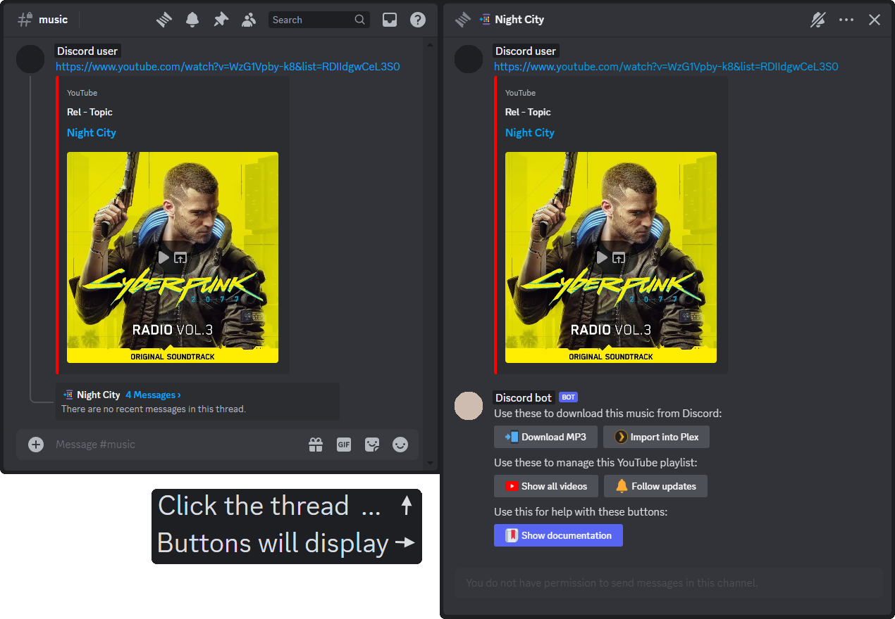

# Plex Music Downloader

## Script — [plex_music_downloader_script.js](plex_music_downloader_script.js)

This script downloads music using [yt-dlp](https://github.com/yt-dlp/yt-dlp) and post-processes it with [ffmpeg](https://github.com/FFmpeg/FFmpeg). Any guild member can download the MP3 file, and authorized guild members can import the file in source quality to the Plex media library on the host machine.

**These values are provided by the user before starting a download:**

| Tag            | Default value                                        | Required |
| -------------- | ---------------------------------------------------- | -------- |
| `Track Title`  | The URLs [oEmbed](https://oembed.com/) `title`       | ✔        |
| `Track Artist` | The URLs [oEmbed](https://oembed.com/) `author_name` | ✔        |
| `Track Start`  | The URLs music start time (usually 00:00:00)         | ✔        |
| `Track End`    | The URLs music end time (such as 00:03:32)           | ✔        |

> _Providing custom `Track Start` or `Track End` times will add post-processed fade effects to improve audio quality._

**These metadata tags are overwrote for better music library integration:**

| Tag            | Value                    |
| -------------- | ------------------------ |
| `Album`        | "Downloads"              |
| `Album Artist` | "Various Artists"        |
| `Artist`       | The `Track Artist` value |
| `Date`         |                          |
| `Title`        | The `Track Title` value  |
| `Track #`      |                          |

> _The `Date` and `Track #` metadata tags have their values removed if they were provided by the source._

## Config — [plex_music_downloader_config.json](plex_music_downloader_config.json)

The following values should be provided before use:

| Key                           | Value                                                                                                                                                                        | Required |
| ----------------------------- | ---------------------------------------------------------------------------------------------------------------------------------------------------------------------------- | -------- |
| `"cron_job_pattern"`          | The Cron pattern for this plugins job                                                                                                                                        | ✔        |
| `"discord_admin_role_id"`     | The Discord guild role ID authorizing Plex changes                                                                                                                           | ✔        |
| `"discord_channel_id"`        | The Discord guild channel ID this plugin will run in                                                                                                                         | ✔        |
| `"discord_plex_emoji"`        | The Discord guild emoji ID containing the Plex logo                                                                                                                          | ✔        |
| `"discord_youtube_emoji"`     | The Discord guild emoji ID containing the YouTube logo                                                                                                                       | ✔        |
| `"plex_authentication_token"` | The Plex token for endpoint authentication [(instructions on how to find it here)](https://support.plex.tv/articles/204059436-finding-an-authentication-token-x-plex-token/) | ✔        |
| `"plex_download_directory"`   | The Plex music download directory (or wherever else you store your downloads)                                                                                                | ✔        |
| `"plex_library_section_id"`   | The Plex music library section ID [(instructions on how to find it here)](https://support.plex.tv/articles/201638786-plex-media-server-url-commands/)                        | ✔        |
| `"plex_server_ip_address"`    | The Plex server IP address (this is usually just `127.0.0.1` for localhost)                                                                                                  | ✔        |
