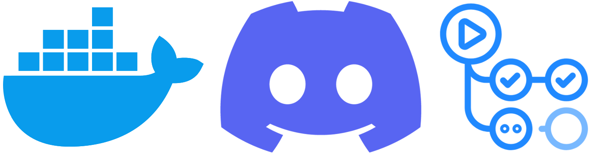
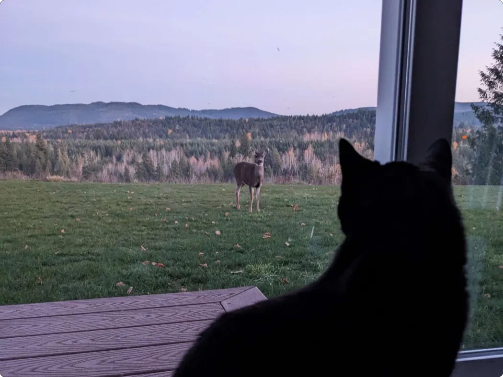
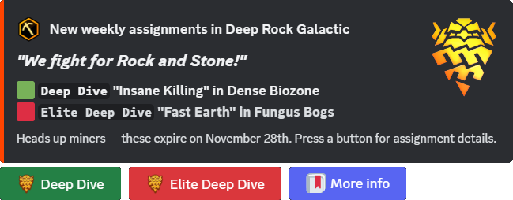
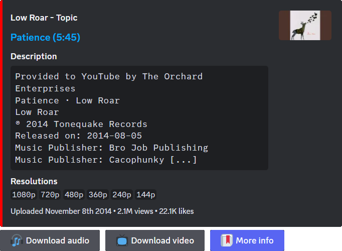
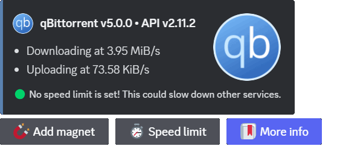
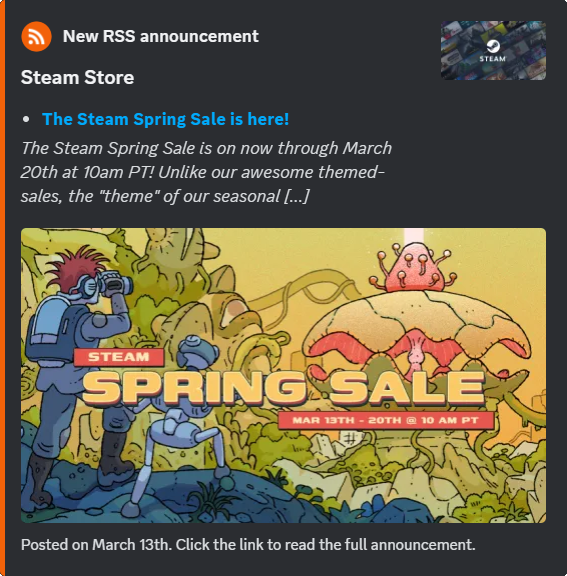
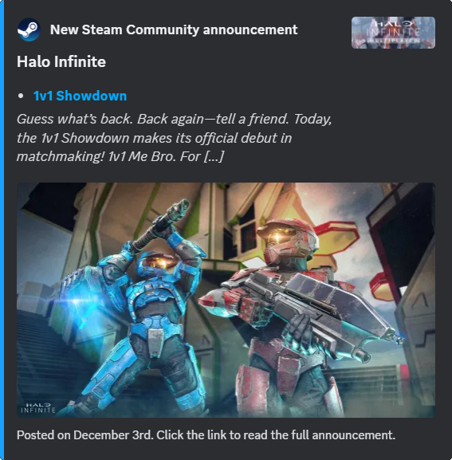

# docker-discord-bot

<!--
TODO:
- Add Emitter customId parameters (BUTTON_DOWNLOAD&user_id=0)
- Github plugin (announce commits, releases, packages, etc)
-->

My Discord bot made with [discord.js](https://discord.js.org/) for the scalable automation of tasks. [Docker image](https://ghcr.io/au-williams/docker-discord-bot:master) is packaged using [GitHub Actions](https://github.com/au-williams/docker-discord-bot/actions) CI/CD. 🐋📦



## Starting the bot

> [!IMPORTANT]
> Required fields in [config.json](config.json) must be updated before the bot can start!
>
> <details>
>  <summary>🛠️ config.json</summary>
>
> | Key                          | Description                                                                                                                                                                                       | Required |
> | :--------------------------- | :------------------------------------------------------------------------------------------------------------------------------------------------------------------------------------------------ | :------- |
> | "discord_bot_admin_user_ids" | The Discord user ID(s) to treat as admin. [(how to find)](https://support.discord.com/hc/en-us/articles/206346498-Where-can-I-find-my-User-Server-Message-ID)                                     | `true`   |
> | "discord_bot_login_token"    | The Discord login token used by the bot. [(how to find)](https://docs.discordbotstudio.org/setting-up-dbs/finding-your-bot-token)                                                                 | `true`   |
> | "discord_config_channel_id"  | The Discord channel ID for the [Config service](#%EF%B8%8F-servicesconfigjs). [(how to find)](https://support.discord.com/hc/en-us/articles/206346498-Where-can-I-find-my-User-Server-Message-ID) | `false`  |
> | "enable_logger_debug"        | Enables displaying the [Logger service](#%EF%B8%8F-servicesloggerjs) `debug` type logs.                                                                                                           | `true`   |
> | "enable_logger_timestamps"   | Enables displaying timestamps in the [Logger service](#%EF%B8%8F-servicesloggerjs) logs.                                                                                                          | `true`   |
> | "enable_messages_service"    | Enables the [Messages service](#%EF%B8%8F-servicesmessagesjs) collection on bot startup.                                                                                                          | `true`   |
> | "enable_temp_file_deletion"  | Enables deleting temporary files in the temp directory.                                                                                                                                           | `true`   |
> | "temp_directory_path"        | The directory path where temporary files are stored.                                                                                                                                              | `true`   |

</details>

This project can be started with [Node.js](https://nodejs.org/en):

```bash
$ node index.js
```

Or be started with [Docker](https://www.docker.com/) using the [Docker image](https://ghcr.io/au-williams/docker-discord-bot:master):

```bash
$ docker-compose up -d
```

> [!TIP]
> Docker is recommended so the bot can automatically start and recover from network issues.

## Anatomy of the bot

The bot is a framework meant to automate many code-heavy tasks working with the Discord API. You simply need to add a new JavaScript file to the `plugins` folder to add functionality. You must export one or more of these objects in that script:

<details>

<summary>📤 export const CronJobs</summary>

### 📤 export const CronJobs

```js
import CronJob from "../entities/CronJob.js";

export const CronJobs = new Set([
  new CronJob()
    .setExpression("* * * * *")
    .setFunction(myFunction)
]);
```

[Cron](https://en.wikipedia.org/wiki/Cron#CRON_expression) is a job scheduler that runs functions on an [expression](https://devhints.io/cron), like every 20 minutes or every Saturday at 9 AM. The bot framework will automatically schedule the Cron jobs you create here. You can extend the Cron jobs with the following setters. 📚

| Name          | Description                                                           | Required |
| :------------ | :-------------------------------------------------------------------- | :------- |
| setEnabled    | Sets the enabled state of the Cron job (used for debugging).          | `false`  |
| setExpression | Sets the Cron expression used when scheduling the Cron job.           | `true`   |
| setFunction   | Sets the function to execute when the Cron job is running.            | `true`   |
| setRunOrder   | Sets the order this Cron job runs with others to avoid race issues.   | `false`  |
| setTriggered  | Sets if the Cron job should run on startup and before the expression. | `false`  |

</details>

<details>

<summary>📤 export const Interactions</summary>

### 📤 export const Interactions

```js
export const Interactions = Object.freeze({
  ButtonComponentWave: "PLUGIN_BUTTON_COMPONENT_WAVE"
});
```

Every action you make in Discord can be thought of as an interaction. Clicking buttons, submitting forms, using slash commands, etc. When we create buttons to click or forms to submit we need to assign them unique IDs that Discord will emit back to us when a user interacts with them. These unique IDs are set on components and used as property keys in the `Listeners` object.

</details>

<details>

<summary>📤 export const Listeners</summary>

### 📤 export const Listeners

```js
import Listener from "../entities/Listener.js";

export const Listeners = Object.freeze({
  [Interactions.ButtonComponentWave]: new Listener()
    .setDescription("Sends the wave emoji when the button is clicked.")
    .setFunction(onButtonComponentWave)
});
```

Listeners handle actions. The property key is a Discord event or interaction from the `Interactions` object. The value is a `Listener` object that will be executed when the key is emitted by Discord. Listeners that only set a function can use that function as the value and the bot framework will automatically wrap it in a Listener. You can use an array to create multiple Listener values for a single key. You can customize the Listener with the following setters. 📚

| Name                    | Description                                                           | Required |
| :---------------------- | :-------------------------------------------------------------------- | :------- |
| setBusyFunction         | Sets the function to execute when the interaction is flagged as busy. | `false`  |
| setDeploymentType       | Sets the type of POST request to use when deploying to Discord.       | `false`  |
| setDescription          | Sets the text displayed when describing functionality to the user.    | `false`  |
| setEnabled              | Sets the enabled state of the listener (typically for debugging).     | `false`  |
| setFunction             | Sets the function to execute when the listener is authorized.         | `true`   |
| setLockedFunction       | Sets the function to execute when the listener is not authorized.     | `false`  |
| setRequiredChannels     | Sets the channel ID(s) required for the listener to be executed.      | `false`  |
| setRequiredChannelTypes | Sets the channel type(s) required for the listener to be executed.    | `false`  |
| setRequiredRoles        | Sets the role ID(s) a user must possess one of to be authorized.      | `false`  |
| setRunOrder             | Sets the order this listener runs with others to avoid race issues.   | `false`  |

</details>

These are the JavaScript files in the `plugins` folder. JSON files of the same name are their config files. These plugins may have their own config files with required fields that must be updated before they can start.

<details>

<!-- plugins/cat_facts_scheduler.js -->

<summary>🧩 plugins/cat_facts_scheduler.js</summary>

### 🧩 plugins/cat_facts_scheduler.js

This JavaScript file sends a new cat fact from the [catfact.ninja API](https://catfact.ninja/) to the announcement channel every day at 9 AM. If the job schedule was missed while the bot was offline then a new cat fact will be sent on startup if the current time is determined to be close enough.

Note: The [catfact.ninja API](https://catfact.ninja/) has awful data consistency... API responses can have spelling or grammar mistakes and duplicate entries. I dumped the API responses and fed them through ChatGPT to fix them. 🤖

### 🛠️ plugins/cat_facts_scheduler.json

| Key                                | Description                                                                                                                                                     | Required |
| :--------------------------------- | :-------------------------------------------------------------------------------------------------------------------------------------------------------------- | :------- |
| "announcement_cron_job_expression" | The Cron job expression to send announcement messages.                                                                                                          | `true`   |
| "announcement_discord_channel_id"  | The Discord channel ID to send messages to. [(how to find)](https://support.discord.com/hc/en-us/articles/206346498-Where-can-I-find-my-User-Server-Message-ID) | `true`   |
| "catfact_responses"                | The cleaned and sanitized catfact.ninja API responses.                                                                                                          | `true`   |

</details>

<!-- plugins/caturday_scheduler.js -->

<details>

<summary>🧩 plugins/caturday_scheduler.js</summary>

### 🧩 plugins/caturday_scheduler.js

</img>

This JavaScript file sends a picture of a users pet to the announcement channel every Saturday at 9 AM. If the job schedule was missed while the bot was offline then a new picture will be sent on bot startup if today is Saturday. `/caturday` shows a file picker to update channel images in the image pool. New members are sent a DM asking them to reply with their pets pictures. DM pictures are forwarded to the bot admins for approval.

### 🛠️ plugins/caturday_scheduler.json

| Key                                | Description                                                                                                                                                     | Required |
| :--------------------------------- | :-------------------------------------------------------------------------------------------------------------------------------------------------------------- | :------- |
| "announcement_caturday_ids"        | The saved Caturday ID(s). This is set by the plugin.                                                                                                            | `true`   |
| "announcement_cron_job_expression" | The Cron job expression to send announcement messages.                                                                                                          | `true`   |
| "announcement_discord_channel_id"  | The Discord channel ID to send messages to. [(how to find)](https://support.discord.com/hc/en-us/articles/206346498-Where-can-I-find-my-User-Server-Message-ID) | `true`   |
| "maintenance_cron_job_expression"  | The Cron job expression to perform maintenance tasks.                                                                                                           | `true`   |

</details>

<!-- plugins/deep_rock_galactic_announcer.js -->

<details>

<summary>🧩 plugins/deep_rock_galactic_announcer.js</summary>

### 🧩 deep_rock_galactic_announcer.js

</img>

This JavaScript file sends assignment updates for the video game [Deep Rock Galactic](https://store.steampowered.com/app/548430/Deep_Rock_Galactic/) to the announcement channel by running a Cron job that fetches the [DRG API](https://drgapi.com/). `/drg` privately sends the author the latest announcement message. Clicking `🟩 Deep Dive` privately sends the in-game deep dive assignments. Clicking `🟥 Elite Deep Dive` privately sends the in-game elite deep dive assignments.

### 🛠️ plugins/deep_rock_galactic_announcer.json

| Key                                | Description                                                                                                                                                     | Required |
| :--------------------------------- | :-------------------------------------------------------------------------------------------------------------------------------------------------------------- | :------- |
| "announcement_cron_job_expression" | The Cron job expression to send announcement messages.                                                                                                          | `true`   |
| "announcement_discord_channel_id"  | The Discord channel ID to send messages to. [(how to find)](https://support.discord.com/hc/en-us/articles/206346498-Where-can-I-find-my-User-Server-Message-ID) | `true`   |
| "discord_emoji_deep_rock_galactic" | The custom emoji in `<:NAME:ID>` format. [(how to find)](https://www.pythondiscord.com/pages/guides/pydis-guides/contributing/obtaining-discord-ids/#emoji-id)  | `true`   |

</details>

<!-- plugins/discord_direct_message_manager.js -->

<details>

<summary>🧩 plugins/discord_direct_message_manager.js</summary>

</details>

<!-- plugins/discord_guild_role_color_manager.js -->

<details>

<summary>🧩 plugins/discord_guild_role_color_manager.js</summary>

### 🧩 plugins/discord_guild_role_color_manager.js

This JavaScript file creates a guild role for each member based on their profile pictures average color and assigns it to them. When their profile picture is changed a new role will be made and the old role unassigned. The old role will be deleted if it has no members. Role names are in hexadecimal format.

### 🛠️ plugins/discord_guild_role_color_manager.json

| Key                          | Description                                                                                                                                                                 | Required |
| :--------------------------- | :-------------------------------------------------------------------------------------------------------------------------------------------------------------------------- | :------- |
| "discord_excluded_guild_ids" | The Discord guild ID(s) this plugin shouldn't manage. [(how to find)](https://www.pythondiscord.com/pages/guides/pydis-guides/contributing/obtaining-discord-ids/#guild-id) | `false`  |
| "discord_excluded_user_ids"  | The Discord user ID(s) this plugin shouldn't manage. [(how to find)](https://support.discord.com/hc/en-us/articles/206346498-Where-can-I-find-my-User-Server-Message-ID)    | `false`  |

</details>

<!-- plugins/plex_music_downloader.js -->

<details>

<summary>🧩 plugins/plex_music_downloader.js</summary>

### 🧩 plugins/plex_music_downloader.js

</img>

This JavaScript file sends a message reply in response to a message with a media link. Clicking `🎧 Download audio` or `📺 Download video` will download the media using [yt-dlp](https://github.com/yt-dlp/yt-dlp) and post-processed with [ffmpeg](https://github.com/FFmpeg/FFmpeg) before re-uploading it to Discord for the user to download. Any guild member can download the resulting files and authorized guild members can import them in source quality to the Plex media library on the host machine.

### 🛠️ plugins/plex_music_downloader.json

| Key                             | Description                                                                                                                                                    | Required |
| :------------------------------ | :------------------------------------------------------------------------------------------------------------------------------------------------------------- | :------- |
| "discord_plex_emoji"            | The custom emoji in `<:NAME:ID>` format. [(how to find)](https://www.pythondiscord.com/pages/guides/pydis-guides/contributing/obtaining-discord-ids/#emoji-id) | `true`   |
| "plex_authentication_token"     | The Plex authentication token used by the bot. [(how to find)](https://support.plex.tv/articles/204059436-finding-an-authentication-token-x-plex-token/)       | `true`   |
| "plex_download_directory_audio" | The Plex download directory path for audio files.                                                                                                              | `true`   |
| "plex_download_directory_video" | The Plex download directory path for video files.                                                                                                              | `true`   |
| "plex_library_section_id_audio" | The Plex audio library section ID. [(how to find)](https://support.plex.tv/articles/201242707-plex-media-scanner-via-command-line)                             | `true`   |
| "plex_library_section_id_video" | The Plex video library section ID. [(how to find)](https://support.plex.tv/articles/201242707-plex-media-scanner-via-command-line)                             | `true`   |
| "plex_media_server_host_url"    | The host URL. `127.0.0.1` or `host.docker.internal` on `:32400`.                                                                                               | `true`   |

</details>

<!-- plugins/qbittorrent_webui_manager.js -->

<details>

<summary>🧩 plugins/qbittorrent_webui_manager.js</summary>

### 🧩 plugins/qbittorrent_webui_manager.js

</img>

This JavaScript file manages the host [qBittorrent](https://www.qbittorrent.org/) client by fetching the [qBittorrent WebUI API](<https://github.com/qbittorrent/qBittorrent/wiki/WebUI-API-(qBittorrent-4.1)>). `/qbittorrent` privately sends the author a message with the current session's info. Clicking `🧲 Add Magnet` opens a popup to add a magnet link to the download queue. Clicking `⏱️ Speed limit` displays a select menu to create, update, or remove the speed limit. The speed limit is automatically removed once the configured time elapses.

### 🛠️ plugins/qbittorrent_webui_manager.json

| Key                         | Description                                                                                                                                                              | Required |
| :-------------------------- | :----------------------------------------------------------------------------------------------------------------------------------------------------------------------- | :------- |
| "cron_job_date"             | The date to remove the speed limit. This is set by the plugin.                                                                                                           | `false`  |
| "discord_required_role_ids" | The Discord role ID(s) required to use this plugin. [(how to find)](https://www.pythondiscord.com/pages/guides/pydis-guides/contributing/obtaining-discord-ids/#role-id) | `true`   |
| "qbittorrent_host_url"      | The host URL. `127.0.0.1` or `host.docker.internal` on `:8080`.                                                                                                          | `true`   |
| "qbittorrent_username"      | The qBittorrent WebUI username to authenticate with.                                                                                                                     | `true`   |
| "qbittorrent_password"      | The qBittorrent WebUI password to authenticate with.                                                                                                                     | `true`   |

</details>

<!-- plugins/rss_feed_announcer.js -->

<details>

<summary>🧩 plugins/rss_feed_announcer.js</summary>

### 🧩 plugins/rss_feed_announcer.js

</img>

</details>

<!-- plugins/steam_community_announcer.js -->

<details>

<summary>🧩 plugins/steam_community_announcer.js</summary>

### 🧩 plugins/steam_community_announcer.js

</img>

This JavaScript file sends [Steam](https://store.steampowered.com/) game news and updates to the announcement channel by running a Cron job that fetches the [Steamworks Web API](https://partner.steamgames.com/doc/webapi_overview). Previews of the announcement are sourced from its response body.

### 🛠️ plugins/steam_community_announcer.json

| Key                                | Description                                                                                                                                                     | Required |
| :--------------------------------- | :-------------------------------------------------------------------------------------------------------------------------------------------------------------- | :------- |
| "announcement_steam_app_ids"       | The Steam app ID(s) to announce news for. [(how to find)](https://gaming.stackexchange.com/questions/149837/how-do-i-find-the-id-for-a-game-on-steam)           | `true`   |
| "announcement_cron_job_expression" | The Cron job expression to send announcement messages.                                                                                                          | `true`   |
| "announcement_discord_channel_id"  | The Discord channel ID to send messages to. [(how to find)](https://support.discord.com/hc/en-us/articles/206346498-Where-can-I-find-my-User-Server-Message-ID) | `true`   |

</details>

JavaScript files in the `services` folder operate the same as plugins but are dependencies of the bot framework. Thus when handling errors plugins will catch and release while services will throw to avoid an invalid system state. You can use these services in your plugin by referencing them.

<details>

<summary>⚙️ services/config.js</summary>

### ⚙️ services/config.js

```js
import { Config } from "../services/config.js";

const config = new Config(import.meta.filename);
```

This JavaScript file manages the config service state. You can create a `Config` object in your plugin using the plugins filename as a parameter - provided by Node.js as `import.meta.filename`. This `Config` object has the file contents of [config.json](config.json) and the JSON file of the plugin's file name (if it exists). After updating data sourced from the plugin JSON file, you can use `config.save()` to update the file content on disk.

If `discord_config_channel_id` is set in [config.json](config.json) then your plugin JSON files will be backed up to that channel on bot startup. You'll be warned if a backup is out of sync thereafter so it can be reuploaded. Reuploading the JSON is done by clicking the `⬆️ Backup` button which backs up your current file after saving the previous backup file to its version history. Clicking `⬇️ Restore` on a backup will rename your JSON file before downloading the backup file.

<!-- TODO: add config key to not be backed up? "enable_backup": false? -->

</details>

<details>

<summary>⚙️ services/emitter.js</summary>

### ⚙️ services/emitter.js

```js
import { Emitter } from "../services/emitter.js";

Emitter.emit({ event });
```

This JavaScript file manages routing events and interactions to plugins and other services. If you created a `Listener` for a [Discord event](https://discord.com/developers/docs/events/gateway-events#receive-events) that's not working, [index.js](index.js) may need an update to pass that event to `Emitter.emit({ event })`. Plugins typically don't have a use for the `Emitter` class unless displaying buttons or other components. Attaching `Emitter.moreInfoButton` to your [ActionRow](https://discordjs.guide/message-components/action-rows.html#building-action-rows) adds a pre-made button providing descriptions of those components when clicked.

</details>

<details>

<summary>⚙️ services/logger.js</summary>

### ⚙️ services/logger.js

```js
import { Logger } from "../services/logger.js";

const logger = new Logger(import.meta.filename);
```

</details>

<details>

<summary>⚙️ services/messages.js</summary>

### ⚙️ services/messages.js

```js
import { Messages } from "../services/messages.js";

const messages = Messages.get({ channelId });
```

This JavaScript file manages the enumerable message history. If `enable_message_service` is set as `true` in [config.json](config.json) then on bot startup a collection of all messages it can read will be created, allowing us to quickly and easily sort them using [ES6 array functions](https://developer.mozilla.org/en-US/docs/Web/JavaScript/Reference/Global_Objects/Array#instance_methods). If `enable_message_service` is set as `false` then the collection won't be created. This saves a significant amount of time on bot startup at the expense of disabling the plugins that use the `Messages` service to function. Setting this value as `false` is used during local development of plugins and <ins>not</ins> server deployments.

</details>

## Deploying the bot

Discord updates context menus and slash commands using a POST request. This typically requires each one to create a [builder](https://discordjs.guide/slash-commands/advanced-creation.html#adding-options) to be included in the POST request but the framework has automated most of this. Your context menus and slash commands must use the `setDeploymentType` setter on their `Listener` objects. Starting the bot with the `deploy` argument will deploy them to Discord for you.

```cmd
$ node index.js deploy
```

> [!WARNING]
> Discord API requires a deployment when creating, updating, or deleting context menus and slash commands!
